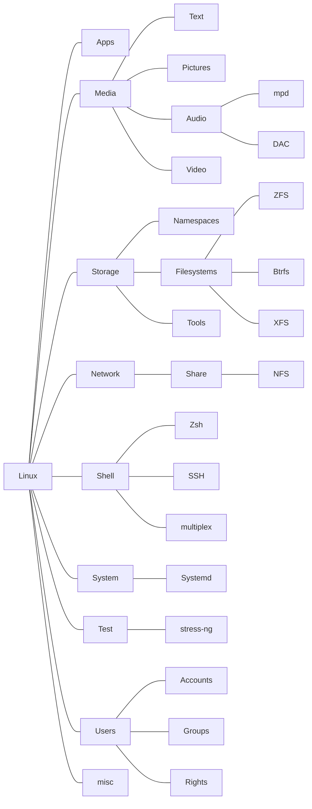

# Linux Notes

<!--

> [!Note]
> Unlike per-file notes, to be found throughout this repository *except* in this directory at the same location of the file itself on a Linux system, these notes are titled and intended at doing a **job**, **solution** a particular problem, **actionable procedure**.
> 
> They involve by essence multiple tools and locations.
> 
> It's hard to find a one-size-fits-all structure, so it may evolve in time, but discoverability will be handled by tags in the metadata of Markdown files.

-->

## Table of contents

A directory note is the `./README.md`  
All READMEs = full toc & intros of these notes

> [!Warning]
> This list is a WIP / TODO!
> A lot may be incorrect or missing at any time.
> 
> 
> `.`  
> `├──` [**Shell**](Shell)  
> `│   ├──` Bash  
> `│   └──` [Zsh](Shell/ZSH)  
> `├──` [**SSH**](SSH)  
> `│   ├──` [`config`](SSH/config.md)  
> `│   ├──` [`ssh-keygen`](SSH/ssh-keygen.md)  
> `│   ├──` [`sshd`](SSH/sshd.md) (OpenSSH Server)   
> `│   └──` [SCP](SSH/SCP.md) (Secure copy protocol)  
> `├──` [**Storage**](Storage)  
> `│   ├──` [Btrfs](Storage/Btrfs.md)  
> `│   ├──` [XFS](Storage/XFS.md)  
> `│   └──` [ZFS](Storage/ZFS)  
> `├──` [**Systemd**](Systemd)  
> `│   ├──` [Services](Systemd/Services.md)  
> `│   └──` [Timers](Systemd/Timers.md)  
> `└──` [**Users**](Users)  
> `    ├──` [Accounts](Users/Accounts.md)  
> `    ├──` [Groups](Users/Groups.md)  
> `    └──` [Rights](Users/Rights.md)  

<!-- TEMPLATE

.  
`├──` zxcv  
`│    ├──` zxcv  
`│    ├──` zxcv  
`│    └──` zxcv  
`├──` zxcv   
`│    └──` zxcv 
`└──` zxcv    
`     ├──` zxcv  
`     ├──` zxcv   
`     └──` zxcv  

-->
Tentative visual summary (not great in my opinion)

